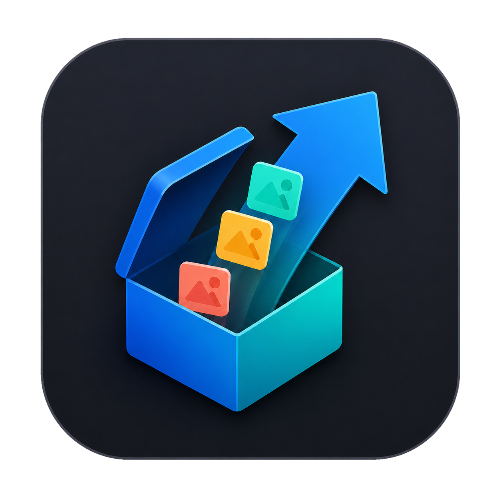

# Immich Exporter for macOS

  

Immich Exporter is a native macOS utility for exporting original photos and videos from a selected Immich user—or every accessible user. It can read a mounted Immich storage directory directly or download media through the Immich API.

> Independent community software. This project is not affiliated with or endorsed by Immich.

## Highlights

- Two export sources: a locally mounted NAS/storage directory or the Immich API
- Automatic discovery of user UUID folders in common Immich storage layouts
- Optional username and email lookup for filesystem UUIDs
- API export for one user or all users visible to the supplied API key
- Live filesystem scan and network download progress, with stop/cancel controls
- Folder output or approximately 500 MB, 1 GB, 2 GB, and 4 GB ZIP parts
- Flat, year, year/month, or original directory layouts in NAS mode
- Photos, videos, common RAW formats, and optional XMP sidecars
- No overwrite: conflicting destination names receive a numeric suffix
- Traditional Chinese and English interface
- No analytics, telemetry, or third-party package dependencies

## Requirements

- macOS 14 or later
- For NAS mode: a local disk or mounted network share containing Immich storage
- For API mode: an Immich server URL and API key with access appropriate to the requested users
- Sufficient destination space, including temporary space while ZIP files are produced or extracted

API behavior and cross-user access depend on the Immich version, account role, API key, and server configuration. Providing a UUID does not bypass Immich access controls.

## Use with a mounted NAS

1. Select **Read from NAS**.
2. Choose the Immich root folder, such as `/Volumes/your-nas/immich`.
3. Select a discovered user UUID. Scanning begins automatically.
4. Choose the output format, folder structure, and optional XMP handling.
5. Choose a destination and select **Start Export**.

The scan displays the number of checked items, discovered media, accumulated size, and current path. Select **Stop Scan** if the wrong UUID was chosen.

### Optional username lookup

Immich storage identifies owners by UUID. To show recognizable account names in NAS mode, expand **Optional: Show User Names for UUIDs**, enter the server URL and API key, then select **Load Names**. This lookup is not required for filesystem exports.

## Export through the Immich API

1. Select **Download through Immich API**.
2. Enter the Immich server URL and API key.
3. Select **Load Users**. A **Stop** button is available while connecting, and connection attempts time out instead of waiting indefinitely.
4. Choose one account or **All Users**.
5. Choose folder output or a ZIP part size, select a destination, and start the export.

The app requests a download plan from `POST /api/download/info`, then downloads each archive from `POST /api/download/archive`. Download progress follows the received byte count and can be cancelled.

For an all-user folder export, each account is placed under a separate `username — UUID prefix` directory. For ZIP output, the same user label is included in every archive filename.

## Output behavior

### Folder output

- NAS mode copies files into the selected directory layout.
- API mode downloads temporary server archives and extracts them into a timestamped export folder.

### ZIP output

- NAS mode groups files by their uncompressed size and creates ZIP archives with macOS `/usr/bin/ditto`.
- API mode asks Immich to group assets using the selected part-size limit and keeps the downloaded ZIP archives.
- Compression ratios and archive overhead vary, so final archive sizes may differ from the selected limit.
- A single file larger than the limit can produce an oversized part.

Temporary staging folders are uniquely named inside the selected destination and are removed after completion, cancellation, or a handled error. A forced termination may leave a staging folder behind.

## Supported media

Common formats include JPEG, PNG, HEIC/HEIF, GIF, WebP, TIFF, AVIF, MOV, MP4, M4V, MKV, AVI, WebM, DNG, NEF, CR2/CR3, ARW, RAF, ORF, and RW2.

## Privacy and safety

- API keys remain in application memory and are not intentionally saved to disk.
- Network requests are sent only to the Immich server entered by the user.
- HTTPS is recommended because an HTTP connection exposes the API key to the network path.
- Source files are opened read-only and existing destination files are not intentionally overwritten.
- The app contains no advertising, analytics, telemetry, or cloud service operated by this project.

See [PRIVACY.md](PRIVACY.md) and [SECURITY.md](SECURITY.md) for details.

## Build from source

1. Open `ImmichExporter.xcodeproj` in Xcode.
2. Select the `ImmichExporter` target.
3. Choose your development team under **Signing & Capabilities**.
4. Build and run the macOS target.

The project uses SwiftUI, Foundation, AppKit, URLSession, and the built-in `/usr/bin/ditto`. It has no third-party package dependencies.

## Known limitations

- Immich storage layouts and APIs can change between server releases.
- Cross-user API export depends entirely on server-side access rules.
- Slow disks, SMB shares, DNS failures, and server-side archive preparation can affect response time.
- Cancelling a blocking filesystem operation takes effect after that operation returns.
- Self-signed HTTPS certificates follow normal macOS trust evaluation.

## Version history

See [CHANGELOG.md](CHANGELOG.md). The current release is **1.1.1**.

## License

Released under the [MIT License](LICENSE). Contributions, issues, and forks are welcome.

---

## 中文簡介

Immich Exporter 是原生 macOS 媒體匯出工具，可直接讀取已掛載的 Immich NAS 儲存目錄，或透過 Immich API 匯出單一使用者及全部可存取使用者的原始照片與影片。

主要功能包括即時掃描與下載進度、停止／取消操作、資料夾匯出、500 MB／1 GB／2 GB／4 GB ZIP 分包、UUID 使用者名稱查詢，以及繁體中文／英文介面。API key 只保留在程式記憶體中；跨使用者存取範圍仍由 Immich 的版本、帳號角色與伺服器設定決定。
