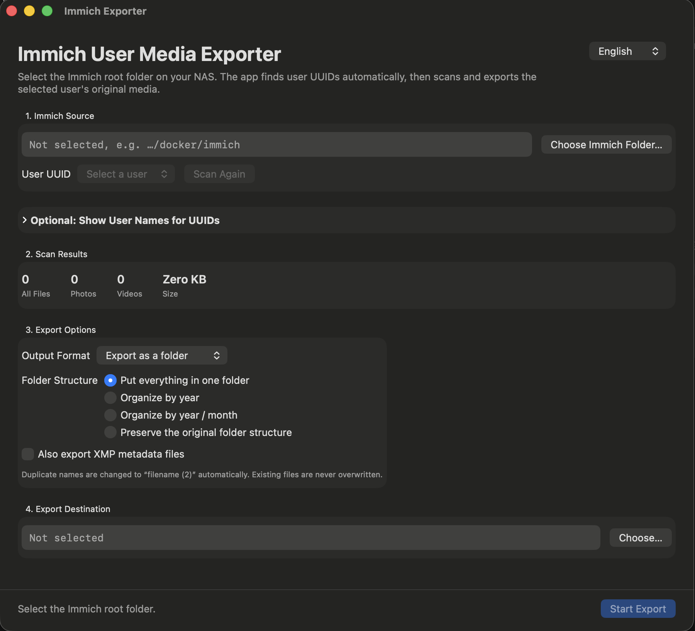

# Immich Exporter for macOS

A native macOS utility for exporting a selected Immich user's original photos and videos from a locally mounted Immich storage directory.

Immich Exporter reads the storage filesystem directly. It automatically discovers user UUID folders, scans supported media, and exports files into a browsable folder or size-limited ZIP archives.

> This is an independent community project and is not affiliated with or endorsed by Immich.

## Screenshot

## Features

- Automatically discovers user UUIDs under common Immich `library` and `upload` layouts
- Shows live scan counts, current path, media totals, and export progress
- Stops an in-progress scan when the wrong user was selected
- Exports photos, videos, RAW images, and optional XMP sidecars
- Supports flat, year, year/month, and original folder structures
- Exports directly to a folder or splits output into approximately 500 MB, 1 GB, 2 GB, or 4 GB ZIP archives
- Avoids overwriting existing files by generating non-conflicting names
- Optional Immich API lookup for displaying names and email addresses alongside UUIDs
- Traditional Chinese and English interface

## Requirements

- macOS 14 or later
- Xcode 16 or later to build from source
- Read access to an Immich storage directory mounted in Finder, such as an SMB/NAS share
- Enough free destination space for the exported files and temporary ZIP staging data

## Build

1. Open `ImmichExporter.xcodeproj` in Xcode.
2. Select the `ImmichExporter` target.
3. Under **Signing & Capabilities**, choose your development team.
4. Build and run the app.

The project uses only Apple system frameworks and macOS's built-in `/usr/bin/ditto` command for ZIP creation. It has no third-party package dependencies.

## Usage

1. Mount the NAS or disk containing the Immich storage directory.
2. Choose the Immich root directory, for example `/Volumes/your-nas/immich`.
3. Wait for the app to discover user UUID folders.
4. Select a UUID. Scanning starts immediately.
5. Choose the output format, folder structure, optional XMP handling, and destination.
6. Select **Start Export**.

Selecting a UUID starts a scan automatically. Use **Stop Scan** in the bottom action bar if the wrong UUID was selected.

## Optional user-name lookup

The filesystem stores media by UUID and does not reliably contain the corresponding account name. Immich Exporter can optionally call the Immich API to display a user's name or email next to the UUID.

1. Expand **Optional: Show User Names for UUIDs**.
2. Enter the Immich server URL.
3. Enter an API key with only the `user.read` permission.
4. Select **Load Names**.

The API key is held in memory for the current app session and is not written to disk. HTTPS is strongly recommended. If an HTTP URL is used on a local network, the key is transmitted without encryption.

## ZIP archive behavior

Archive limits are calculated from uncompressed input file sizes. Compression ratios and ZIP overhead vary, so the final archive size may differ slightly from the selected value. A single file larger than the limit is placed in its own archive.

ZIP exports use a temporary hidden staging directory inside the selected destination. The app removes that directory after completion, cancellation, or an error. Ensure the destination has enough free space for both staging files and completed archives while an export is running.

## Supported formats

Common formats include JPEG, PNG, HEIC/HEIF, GIF, WebP, TIFF, AVIF, MOV, MP4, M4V, MKV, AVI, WebM, and common RAW formats such as DNG, NEF, CR2/CR3, ARW, RAF, ORF, and RW2.

## Safety and privacy

- Source media is opened read-only; exports are created at the user-selected destination.
- Existing destination files are not overwritten.
- API access is optional and is used only to retrieve user identity metadata.
- No analytics, telemetry, or cloud upload is included.
- Review [PRIVACY.md](PRIVACY.md) and [SECURITY.md](SECURITY.md) before using the optional API feature.

## Known limitations

- Immich storage layouts may change between server releases.
- A slow NAS or SMB mount can make directory discovery and media scanning take a long time.
- Cancelling during a single blocking filesystem operation takes effect after that operation returns.
- Self-signed HTTPS certificates are subject to normal macOS trust evaluation.

## License

Immich Exporter is available under the [MIT License](LICENSE). Contributions and forks are welcome.

## 中文簡介

Immich Exporter 是原生 macOS 工具，可從已掛載的 Immich 儲存目錄自動找出使用者 UUID，掃描原始照片與影片，並匯出成一般資料夾或依容量分包的 ZIP。API 使用者名稱查詢是選用功能；不提供網址與 API key 也能完整使用 UUID 掃描與匯出功能。
